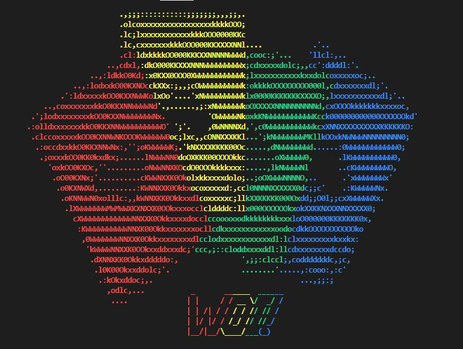

<div align="center">
  <h1 align="center">Candy Kingdom and Blackjack Game</h1>

  <p align="center">
    Poker-like game dan Blackjack game in one Program!
  </p>
</div>

<p align="center">
    
</p>

> Composed to fulfill Tubes 1 IF2210 Pemrograman Berorientasi Objek


## Daftar Isi
* [Deskripsi Program](#deskripsi-program)
* [Anggota Kelompok](#anggota-kelompok)
* [Daftar Kelas dan Status Pengerjaan](#daftar-kelas-dan-status-pengerjaan)
* [Cara Menjalankan Program](#cara-menjalankan-program)
* [Screenshots](#screenshots)


## Deskripsi Program

This Program have two game using Command Line Interface. The Main game is Candy Kingdom Cards Game, that is poker-like game but instead of using clubs, hearts, spades, and diamond this game use red, blue, green, and yellow as suits. This game also have an additional card that is Ability Card consist of 
- Re-Roll
- SwapCard
- Switch
- Quadruple
- Quarter
- Abilityless
- Reverse

the second game is blackjack, this game is like the original game.


## Anggota Kelompok

NIM | Nama |
--- | --- |
13521063 | Salomo Reinhart Gregory Manalu |
13521069 | Louis Caesa Kusuma |
13521071 | Margaretha Olivia Haryono |
13521085 | Addin Munawwar Yusuf |
13521119 | Muhammad Rizky Sya’ban |


## Daftar Kelas dan Status Pengerjaan

| Kelas            | Status |
|------------------|--------|
| Ability          | ok     |
| Action           | ok     |
| BlackJack        | ok     |
| Card             | ok     |
| Combo            | ok     |
| SearchCombo      | ok     |
| Deck             | ok     |
| Exception        | ok     |
| Game             | ok     |
| InventoryHolder  | ok     |
| IO               | ok     |
| ObjectWithValue  | ok     |
| Player           | ok     |
| Point            | ok     |
| Table            | ok     |


## Cara Menjalankan Program

### 1. Clone repo

```sh
git clone git@github.com:margarethaolivia/Tubes-1-OOP_WOI.git
```

atau bila menggunakan https

```sh
git clone https://github.com/margarethaolivia/Tubes-1-OOP_WOI.git
```

### 2. Compile the program

#### Windows

Pastikan g++ dan cmake telah terinstall. Buka terminal pada folder project, lalu jalankan makefile

```sh
mingw32-make build
```

#### Linux

Pastikan g++ dan cmake telah terinstall. Buka terminal pada folder project, lalu jalankan makefile

```sh
make build
```

### 3. Run the app

Pada Windows, jalankan

```sh
./bin/WOI.exe
```

atau pada Linux, jalankan

```sh
./bin/WOI
```


# Screenshots

